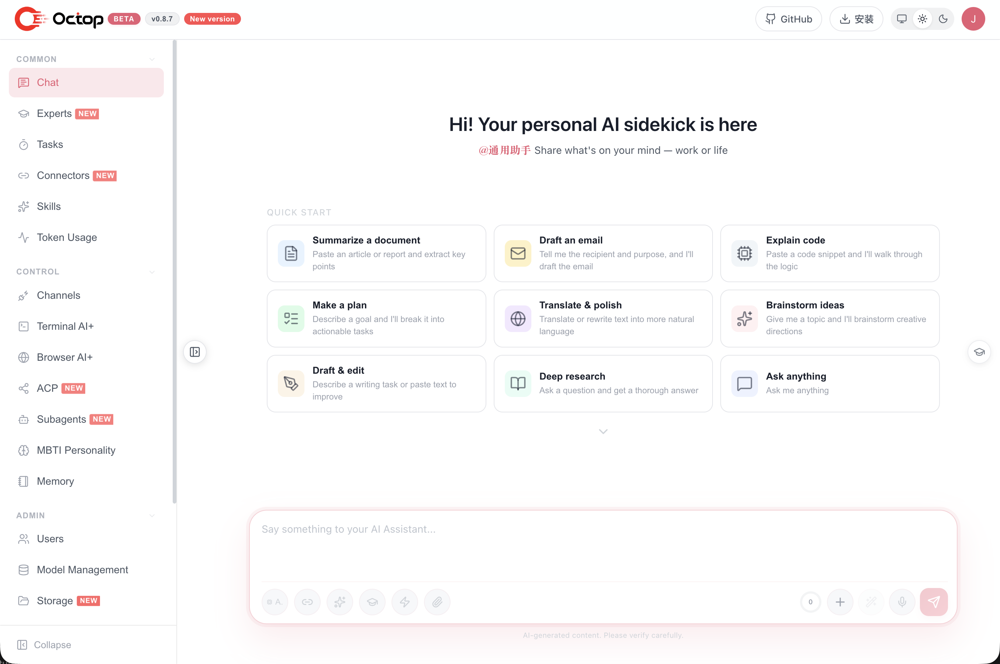

<p align="center">
  
</p>

<p align="center">
  <strong>A smarter, self-hosted AI assistant — multi-user, multi-agent.</strong>
</p>

<p align="center">
  <a href="https://www.python.org/downloads/"></a>
  <a href="https://github.com/TencentCloud/orca/blob/main/LICENSE"></a>
  <a href="https://github.com/TencentCloud/Octop/releases"></a>
  <a href="https://pypi.org/project/octop/"></a>
  <a href="https://github.com/astral-sh/ruff"></a>
  <a href="https://github.com/TencentCloud/orca"></a>
</p>

<p align="center">
  <a href="#-highlights">Highlights</a> ·
  <a href="#-overview">Overview</a> ·
  <a href="#-core-technology">Core Technology</a> ·
  <a href="#-features">Features</a> ·
  <a href="#-quick-start">Quick Start</a> ·
  <a href="#-contents">Contents</a>
</p>

<p align="center">
  <b>English</b> · <a href="README_CN.md">中文</a>
</p>

---

**Octop** is an open-source, self-hosted AI assistant. It's not just a tool — it's a digital life form that can operate in parallel. Through its multi-agent architecture, it builds an intelligent environment that is both independent and collaborative for teams, families, and individuals. Best of all, it runs entirely on your machine — the fully self-hosted design means privacy is never a compromise, while single-process startup makes the powerful web console, CLI, and IM integrations readily accessible.

Chat through the Web Dashboard, Feishu, DingTalk, QQ, Discord, WeCom, or programmatic HTTP/SSE. Extend capabilities with the **expert library**, **Connectors** (OAuth + MCP), and **ACP** integration for IDE workflows.

## ✨ Highlights

| | Feature | Description |
|---|---------|-------------|
| 👥 | **Multi-user expert team** | One admin, shared household; built-in expert library — switch specialists per scenario |
| 🎭 | **MBTI personas** | 16 personality templates plus an interactive quiz — give each agent a distinct character |
| 🔒 | **Security built-in** | JWT multi-user isolation, tool approval, shell command guardrails, and PII redaction — data stays local |
| 🔌 | **Connector ecosystem** | Tencent suite (Docs, Weibo trends, News, …); OAuth and MCP gateway extend resource boundaries |
| 💾 | **Pluggable backends** | Local disk, Docker containers, PostgreSQL, or COS/S3 — AI operates inside isolated boundaries |
| 🧠 | **Portable memory** | Powered by harness-memory; memory migrates with the workspace |
| ↔️ | **ACP bidirectional** | `octop acp` for IDE/terminal AI; delegate to OpenCode / Claude Code with permission gates |
| 💻 | **Terminal AI+** | Interactive shell in the browser — AI-assisted command execution and troubleshooting |
| 🌐 | **Browser AI+** | Headless Chromium sessions for web automation, screenshots, and remote browsing |
| 🏠 | **Self-hosted** | Dashboard, CLI, IM channels, and cron in one `octop run` — all data under `~/.octop/` |

## 📌 Overview

Octop is a self-hosted AI assistant platform for households and small teams. It runs a single process that serves a web dashboard, a CLI, IM channels (Feishu, DingTalk, QQ, Discord, WeCom, and more), and cron automation — all sharing one SQLite database under `~/.octop/`.

> Octop's design goal: keep every conversation, workspace, and credential on your own machine, while giving each user a personal team of specialized agents they can switch between per task.

## 🧠 Core Technology

| Layer | Technology |
|-------|-----------|
| **Language** | Python 3.11+ |
| **Web framework** | FastAPI + uvicorn |
| **Agent runtime** | harness-agent |
| **Gateway** | harness-gateway |
| **Control plane DB** | SQLite (WAL) via aiosqlite |
| **Frontend** | React 18 + TypeScript + Vite + Ant Design |
| **Scheduling** | APScheduler |
| **ACP** | agent-client-protocol |
| **Build / quality** | hatchling · ruff · mypy · pytest |

Octop is built on the Harness stack — a set of focused runtimes that Octop composes into one process:

- **harness-agent** — LangGraph-based agent runtime: model routing, tools, skills, and conversation checkpointing.
- **harness-gateway** — multi-platform IM channel bridge that normalizes incoming messages into a single processing pipeline.
- **harness-memory** — hierarchical recall with full-text search, so an agent's memory travels with its workspace.
- **harness-browser** — CDP-based browser automation with persistent profiles for web tasks.

Instead of an external queue or message broker, Octop routes every surface — Web UI, IM, and cron — through one in-process `HarnessProcessor`. The result is a single, restart-safe process whose entire state is rebuilt from `~/.octop/octop.db` on boot.

## 🤔 Features

### Server & auth
- Multi-user JWT authentication with admin role
- First-run setup wizard (`octop init`)
- Interactive API docs at `/api/docs` (off by default — set `"enable_api_docs": true` in `config.json` to enable)

### Agents
- Multiple agents per user; each has its own workspace, providers, channels, and cron
- 16 MBTI persona templates + custom system prompt
- Expert library scanned at boot (`infra/agents/experts/library/`)
- Workspace backends: local disk, COS, S3, and other remote stores

### Channels & automation
- IM channels: Feishu, DingTalk, QQ, Discord, WeCom, and more
- Proactive cron jobs with natural-language and slash-command triggers
- Unified message processing across Web UI, IM, and cron surfaces

### Surfaces
- **Web dashboard** — chat, agents, connectors, channels, cron, settings
- **CLI** — `octop run`, `octop chat`, `octop acp`, admin commands
- **HTTP/SSE API** — full programmatic access

### ACP (Agent Client Protocol)

Octop supports ACP in two directions:

1. **Inbound** — external tools use **your** Octop agent
   ```bash
   octop acp --agent main   # stdio ACP server for Zed, OpenCode, …
   ```

2. **Outbound** — Octop delegates to external coding agents
   - Dashboard → **ACP** (`/acp`): configure runners (global per user)
   - Enable **acp_runner** per agent, then delegate in chat

Built-in outbound runners include OpenCode, CodeBuddy, Claude Code, and Codex.

Full setup: **[docs/acp.md](docs/acp.md)**.

## 🚀 Quick Start

### Prerequisites

- **macOS / Linux / Windows**
- No pre-installed Python required — the installer uses [uv](https://docs.astral.sh/uv/) to provision Python 3.12 in an isolated venv under `~/.octop/`

### 1. Install

**macOS / Linux** — one-line installer (recommended):

```bash
curl -fsSL https://finnie-1258344699.cos.ap-guangzhou.myqcloud.com/octop/install.sh | bash
```

**Windows (PowerShell)**:

```powershell
irm https://finnie-1258344699.cos.ap-guangzhou.myqcloud.com/octop/install.ps1 | iex
```

**Windows (cmd)** — download and run, or from a cloned repo:

```bat
curl -fsSL https://finnie-1258344699.cos.ap-guangzhou.myqcloud.com/octop/install.bat -o install.bat
install.bat
```

After installation, open a **new terminal** or reload your shell:

```bash
source ~/.zshrc   # Zsh
# or
source ~/.bashrc  # Bash
```

The installer places `octop` on your PATH via `~/.octop/bin`. Optional extras:

```bash
# Browser automation (Playwright Chromium)
curl -fsSL https://finnie-1258344699.cos.ap-guangzhou.myqcloud.com/octop/install.sh | bash -s -- --extras browser

# Feishu channel support
curl -fsSL https://finnie-1258344699.cos.ap-guangzhou.myqcloud.com/octop/install.sh | bash -s -- --extras channels-feishu
```

See [scripts/README.md](scripts/README.md) for all install options (`--version`, `--from-source`, `--mirror`, Windows flags).

**Alternative — PyPI** (if you already manage Python yourself):

```bash
pip install octop
# optional: pip install "octop[browser]"
```

### 2. Initialize

```bash
octop init
```

The interactive wizard creates the SQLite database, JWT secret, and first admin account under `~/.octop/`.

### 3. Run

```bash
# Foreground (API + Web dashboard)
octop run

# Custom host / port
octop run --host 0.0.0.0 --port 8088

# Register as a system service (systemd / launchd / Windows service)
octop service start
```

Open **http://127.0.0.1:8088** — default credentials are `admin` / `octop` (change immediately).

### Docker (recommended for production)

```bash
# Build and start
docker compose -f deploy/docker-compose.yml up -d

# Or build manually
bash deploy/docker_build.sh
docker run -d \
  -p 8088:8088 \
  -v octop-data:/data/.octop \
  -e HOME=/data \
  -e OCTOP_DEFAULT_PASSWORD=changeme \
  octop:latest
```

Open `http://localhost:8088` — default credentials are `admin` / `octop` (change immediately).

| Variable | Default | Description |
|----------|---------|-------------|
| `OCTOP_PORT` | `8088` | HTTP listen port |
| `OCTOP_DEFAULT_PASSWORD` | `octop` | First-run admin password |
| `OCTOP_ADMIN_USERNAME` | `admin` | First-run admin username |
| `OCTOP_DATA` | `~/.octop` | Host data directory (compose bind mount) |

See [`.env.example`](.env.example) for the full list.

## 📑 Contents

- [Highlights](#-highlights)
- [Overview](#-overview)
- [Core Technology](#-core-technology)
- [Features](#-features)
- [Quick Start](#-quick-start)
- **Deploy & Use**
  - [Install options](#-install-options)
  - [Configuration](#-configuration)
  - [CLI reference](#-cli-reference)
  - [Web dashboard](#-web-dashboard)
  - [Data directory](#-data-directory)
- **Architecture & Dev**
  - [Architecture](#-architecture)
  - [Project layout](#-project-layout)
  - [Development](#-development)
- **Project Info**
  - [Security & privacy](#-security--privacy)
  - [Contributing](#-contributing)
  - [Changelog](#-changelog)
  - [Related projects](#-related-projects)
  - [License](#-license)

## 📦 Install options

| Method | Platform | Description |
|--------|----------|-------------|
| Remote one-liner | macOS / Linux | `curl …/octop/install.sh \| bash` |
| Remote one-liner | Windows | `irm …/octop/install.ps1 \| iex` or `install.bat` |
| Local script | macOS / Linux | `bash scripts/install.sh` |
| Local script | Windows | `scripts\install.bat` or `install.ps1` |
| PyPI | Any | `pip install octop` or `pip install "octop[browser]"` |
| Docker | Any | `deploy/docker-compose.yml` |

All install scripts provision an isolated environment at `~/.octop/venv` and a `~/.octop/bin/octop` wrapper — they do not touch system Python.

## ⚙️ Configuration

All runtime state lives in `~/.octop/`. Manage it via CLI or edit files directly.

```bash
# LLM providers and models
octop models
octop provider list

# IM channels
octop channel list
octop channel install

# Skills (per agent)
octop skills list --agent main

# Cron jobs
octop cron list
octop cron create --help

# Users (admin)
octop user list
```

### Supported LLM providers

OpenAI-compatible APIs, DashScope (Qwen), Ollama, and other presets — configure per agent in the dashboard or via `octop provider`.

### Supported channels

| Channel | Credentials |
|---------|-------------|
| **Feishu** | App ID, App Secret |
| **DingTalk** | App Key, App Secret |
| **QQ** | Bot AppID, Token |
| **Discord** | Bot Token |
| **WeCom** | Corp ID, Agent Secret |
| **Web Dashboard** | Enabled by default |

## 📖 CLI reference

| Command | Description |
|---------|-------------|
| `octop init` | Bootstrap `~/.octop/` (DB, admin, JWT secret) |
| `octop run` | Start Octop in the foreground |
| `octop service start` | Install and start as a system service |
| `octop service stop` | Stop the system service |
| `octop agent` | Create, list, start/stop agents |
| `octop channel` | Install and manage IM channels |
| `octop chats` | REPL and session management |
| `octop acp` | Stdio ACP server for IDE integration |
| `octop cron` | Manage scheduled tasks |
| `octop models` | Provider presets and model resolution |
| `octop skills` | Enable/disable per-agent skills |
| `octop backup` | Export / restore backups |
| `octop clean` | Remove CLI state or wipe `~/.octop/` |
| `octop update` | Check for and install updates |

Full reference: **[docs/cli.md](docs/cli.md)**.

## 🖥️ Web dashboard

After `octop run`, open **http://127.0.0.1:8088**.

<p align="center">
  
</p>

- **Chat** — real-time conversation with agents
- **Agents** — create agents, pick experts / MBTI personas, configure providers
- **Connectors** — OAuth apps and MCP gateways
- **Channels** — IM platform setup
- **Cron** — visual cron job management
- **ACP** — configure outbound coding-agent runners
- **Settings** — users, security, TLS, system

Interactive API docs: **http://127.0.0.1:8088/api/docs** (disabled by default — enable by setting `"enable_api_docs": true` in `config.json`)

## 📁 Data directory

```
~/.octop/                          ← install & data root
├── octop.db                       # SQLite — users, agents, channels, cron, …
├── secrets/                       # JWT secret, channel tokens
├── agents/<agent_id>/             # per-agent workspace (SOUL.md, skills, …)
├── security/tool_guard/           # shell command allow/deny rules
├── logs/                          # runtime logs
├── venv/                          # uv-managed Python (installer layout)
└── bin/octop                      # PATH wrapper → venv/bin/octop
```

See [docs/configuration.md](docs/configuration.md) for env vars and `config.json`.

## 🏗️ Architecture

```
OctopServer
 ├─ DBPool               SQLite (WAL mode)
 ├─ SharedServices       DI root — every repo + config
 ├─ ExpertCatalog        scans agents/experts/library/ at boot
 ├─ UserManager
 │   └─ HarnessAgentManager (per user)
 │       └─ AgentRuntime (per agent)
 │           ├─ HarnessAgent      LangGraph runtime (harness-agent)
 │           ├─ HarnessProcessor  IM / UI / cron entry point
 │           ├─ ChannelManager    IM connections (harness-gateway)
 │           └─ CronManager       APScheduler
 └─ FastAPI app (uvicorn)
```

Single process. Restart rebuilds state from `~/.octop/octop.db`.

See [docs/architecture.md](docs/architecture.md) and [docs/adr/001-single-process-model.md](docs/adr/001-single-process-model.md).

## 📁 Project layout

```
src/octop/
  config.py    env-var config
  launch.py    OctopServer boot + uvicorn
  infra/       business core (agents, gateway, cron, db, users, …)
  api/         HTTP layer — FastAPI app, routers, JWT, SSE
  cli/         CLI layer — Click commands
  dashboard/   built React SPA (wheel artifact)

dashboard/     frontend source (Vite) — edit here, run make build-frontend

deploy/        Docker Compose, entrypoint, build & deploy scripts
tests/         unit/ + integration/
```

## 🛠️ Development

**Prerequisites:** Python 3.11+, Node 18+, [uv](https://docs.astral.sh/uv/)

```bash
# Backend
make install          # pip install -e ".[dev]"
make all              # lint + typecheck + test (ship bar)

# Frontend (separate terminal)
make dev-frontend     # Vite dev server on :5173
make build-frontend   # production build → src/octop/dashboard/
cd dashboard && npx tsc --noEmit
```

Individual targets: `make test`, `make lint`, `make typecheck`, `make format`.

## 🔒 Security & privacy

- **Local-first**: Config, chats, workspaces, and credentials live under `~/.octop/` on your machine.
- **Multi-user isolation**: JWT auth with per-user agents and workspaces.
- **Tool guardrails**: User-editable shell command rules under `~/.octop/security/tool_guard/`.
- **No vendor lock-in**: Swap LLM providers, storage backends, and channels without rewriting agents.

## 🤝 Contributing

Contributions are welcome:

1. Fork the repository
2. Create a feature branch (`git checkout -b feature/amazing-feature`)
3. Run `make all` (backend) or `make check-all` (full stack) before submitting
4. Open a Pull Request

See [CONTRIBUTING.md](CONTRIBUTING.md) for the full guide. Security issues: [SECURITY.md](SECURITY.md).

Module boundaries and coding conventions: [AGENTS.md](AGENTS.md).

## 📋 Changelog

See [CHANGELOG.md](CHANGELOG.md) for release history.

## 🔗 Related projects

| Project | Description |
|---------|-------------|
| harness-agent | Agent runtime — model routing, tools, skills, checkpointing |
| harness-gateway | Multi-platform IM channel bridge |
| harness-memory | Hierarchical recall and FTS search |
| harness-browser | CDP browser automation with persistent profiles |

> These `harness-*` projects are being prepared for open-sourcing; repository links will be added once they are published.

## 📄 License

This project is licensed under the [MIT License](LICENSE).
