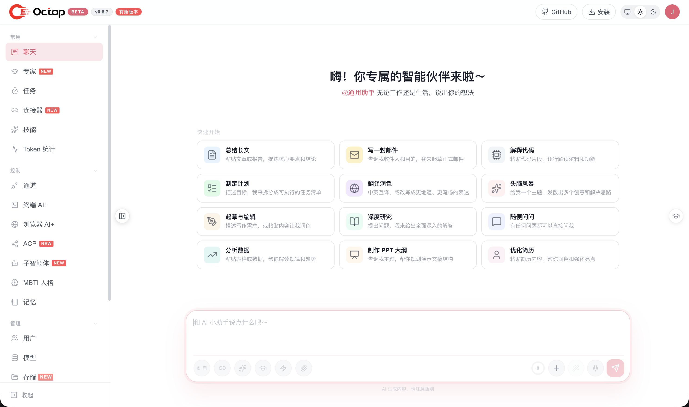

<p align="center">
  
</p>

<p align="center">
  <strong>支持多用户、多 Agent 的自托管 AI 助手 — 更聪明，更懂你。</strong>
</p>

<p align="center">
  <a href="https://www.python.org/downloads/"></a>
  <a href="https://github.com/Octopkit/Octop/blob/main/LICENSE"></a>
  <a href="https://pypi.org/project/octop/"></a>
  <a href="https://github.com/astral-sh/ruff"></a>
  <a href="https://github.com/Octopkit/Octop"></a>
</p>

<p align="center">
  <a href="#-概述">概述</a> ·
  <a href="#-亮点">亮点</a> ·
  <a href="#-核心技术">核心技术</a> ·
  <a href="#-功能特性">功能特性</a> ·
  <a href="#-快速开始">快速开始</a>·
  <a href="#-目录">目录</a>
</p>

<p align="center">
  <a href="README.md">English</a> · <b>中文</b>
</p>

---

## 📌 概述

**Octop** 是一个开源、自托管的 AI 助手。它不仅是工具，更是可并行运作的数字生命体。通过多 Agent 架构，它为团队、家庭和个人构建了既独立又协作的智能环境。并且这一切都运行在你的机器上——完全自托管的设计让隐私不再是妥协，而单进程启动的便捷性，则让强大的 Web 控制台、CLI 与 IM 集成触手可及。

借助飞书、钉钉、QQ、Discord、企业微信或 HTTP/SSE API 与任意 Agent 对话；通过**专家库**一键创建专业角色，通过 **Connector**（OAuth + MCP）接入外部服务，通过 **ACP** 与 IDE / 终端 AI 工具双向协作。

> Octop 的设计目标：让每一次对话、工作区与凭据都留在你自己的机器上，同时为每个用户配备一组可按场景切换的专业 Agent。

## ✨ 亮点

| | 特性 | 说明 |
|---|------|------|
| 👥 | **多用户多 Agent 专家团** | 一人管理，全家共用；内置专家库，按场景切换专业角色 |
| 🎭 | **MBTI 人格** | 16 种人格模板与互动测试，为每个 Agent 赋予鲜明性格 |
| 🔒 | **更安全** | JWT 多用户隔离、工具审批、Shell 命令防护与敏感信息脱敏，数据留在本地 |
| 🔌 | **Connector 拓展体系** | 一键接入腾讯全家桶（文档 / 微博 / 新闻等），OAuth 与 MCP 网关轻松扩展 |
| 💾 | **可插拔后端存储** | 本地目录、Docker 容器、PostgreSQL 或 COS/S3，AI 在隔离边界内操作 |
| 🧠 | **可迁移记忆系统** | 基于 harness-memory，记忆随工作区迁移 |
| ↔️ | **ACP 双向集成** | `octop acp` 增强 IDE 与终端 AI；对话中委派 OpenCode / Claude Code 等 |
| 💻 | **终端 AI+** | 浏览器内交互式 Shell，AI 辅助命令执行与排障 |
| 🌐 | **浏览器 AI+** | 基于 Chromium 的无头浏览器会话，支持网页自动化、截图与远程操控 |
| 🏠 | **可自托管** | 一条 `octop run` 即可运行控制台、CLI、IM 通道与定时任务，数据存于 `~/.octop/` |

<details>
<summary>🐾 你能用 Octop 做什么</summary>

- **个人助理** — 让专属 Agent 帮你写周报、整理资料、定日程，记忆随工作区长期保留。
- **家庭共享** — 一个管理员账号，全家共用；按成员分配不同 Agent 与专家角色。
- **团队助手** — 多 Agent 并行协作，对接飞书 / 钉钉 / 企业微信，把任务自动分发到群里。
- **开发者增效** — 通过 ACP 把编码任务委派给 OpenCode / Claude Code，或在终端用 AI 辅助排障。
- **网页自动化** — 用浏览器 AI+ 自动填表、截图、采集公开信息。
- **定时任务** — 用自然语言配置 Cron，让 Agent 每天按时推送或执行任务。

</details>


## 🧠 核心技术

| 层级 | 技术 |
|------|------|
| **语言** | Python 3.11+ |
| **Web 框架** | FastAPI + uvicorn |
| **Agent 运行时** | harness-agent |
| **IM 桥接** | harness-gateway |
| **控制平面数据库** | SQLite (WAL) + aiosqlite |
| **前端** | React 18 + TypeScript + Vite + Ant Design |
| **调度** | APScheduler |
| **ACP** | agent-client-protocol |
| **构建 / 质量** | hatchling · ruff · mypy · pytest |

Octop 基于一系列 Harness 工程实践构建——它将这些专注的运行时组合进同一个进程：

- **harness-agent** — Agent 运行时：模型路由、工具、技能与对话检查点。
- **harness-gateway** — 多平台 IM 通道桥接，将各类入站消息归一为统一的处理管线。
- **harness-memory** — 分层记忆与全文检索，让 Agent 的记忆随工作区一同迁移。
- **harness-browser** — 基于 CDP 的浏览器自动化，支持持久化配置，用于网页类任务。

Octop 不依赖外部消息队列或中间件，而是通过进程内的 `HarnessProcessor` 统一路由所有入口——Web UI、IM 与定时任务。最终呈现为一个可重启恢复的单进程：启动时整个状态都从 `~/.octop/octop.db` 重建。

## 🤔 功能特性

### 服务器与认证
- 多用户 JWT 认证，支持管理员角色
- 首次运行向导（`octop init`）
- 交互式 API 文档：`/api/docs`（默认关闭 — 在 `config.json` 中设置 `"enable_api_docs": true` 开启）

### Agent
- 每位用户可创建多个 Agent；各自拥有独立工作区、供应商、通道和定时任务
- 16 种 MBTI 人格模板 + 自定义系统提示词
- 启动时扫描专家库（`infra/agents/experts/library/`）
- 工作区后端：本地磁盘、COS、S3 及其他远程存储

### 通道与自动化
- IM 通道：飞书、钉钉、QQ、Discord、企业微信等
- 主动定时任务，支持自然语言和斜杠命令触发
- Web UI、IM、定时任务共用同一套消息处理链路

### 使用入口
- **Web 控制台** — 对话、Agent 管理、连接器、通道、定时任务、设置
- **CLI** — `octop run`、`octop chat`、`octop acp`、管理命令
- **HTTP/SSE/WebSocket API** — 完整的程序化访问能力

### ACP（Agent Client Protocol）

Octop 支持两个方向的 ACP 集成：

1. **入站** — 外部工具使用**你的** Octop Agent
   ```bash
   octop acp --agent main   # 为 Zed、OpenCode 等提供 stdio ACP 服务
   ```

2. **出站** — Octop 委派给外部编程 Agent
   - 控制台 → **ACP**（`/acp`）：配置 Runner（按用户全局）
   - 为 Agent 启用 **acp_runner** 后，在对话中委派任务

内置出站 Runner 包括 OpenCode、CodeBuddy、Claude Code 和 Codex。

完整配置：**[docs/acp.md](docs/acp.md)**。

## 🚀 快速开始

### 环境要求

- **macOS / Linux / Windows**
- 无需预先安装 Python — 安装脚本通过 [uv](https://docs.astral.sh/uv/) 在 `~/.octop/` 下创建隔离的 Python 3.12 虚拟环境

### 1. 安装

**macOS / Linux** — 一键安装（推荐）：

```bash
curl -fsSL https://finnie-1258344699.cos.ap-guangzhou.myqcloud.com/octop/install.sh | bash
```

**Windows（PowerShell）**：

```powershell
irm https://finnie-1258344699.cos.ap-guangzhou.myqcloud.com/octop/install.ps1 | iex
```

**Windows（cmd）** — 下载后运行，或从已克隆的仓库执行：

```bat
curl -fsSL https://finnie-1258344699.cos.ap-guangzhou.myqcloud.com/octop/install.bat -o install.bat
install.bat
```

安装完成后，请打开**新终端**，或重新加载 shell 配置：

```bash
source ~/.zshrc   # Zsh
# 或
source ~/.bashrc  # Bash
```

安装脚本会将 `octop` 加入 PATH（`~/.octop/bin`）。可选附加组件：

```bash
# 浏览器自动化（Playwright Chromium）
curl -fsSL https://finnie-1258344699.cos.ap-guangzhou.myqcloud.com/octop/install.sh | bash -s -- --extras browser

# 飞书通道支持
curl -fsSL https://finnie-1258344699.cos.ap-guangzhou.myqcloud.com/octop/install.sh | bash -s -- --extras channels-feishu
```

完整安装选项见 [scripts/README.md](scripts/README.md)（`--version`、`--from-source`、`--mirror` 及 Windows 参数）。

**备选 — PyPI**（若你已自行管理 Python 环境）：

```bash
pip install octop
# 可选：pip install "octop[browser]"
```

### 2. 启动

```bash
# 前台运行（API + Web 控制台）
octop run

# 自定义主机与端口
octop run --host 0.0.0.0 --port 8088

# 注册为系统服务（systemd / launchd / Windows 服务）
octop service start
```

打开 **http://127.0.0.1:8088** — 默认账号 `admin` / `octop`（请立即修改密码）。

> ⚠️ **安全提醒：** 默认管理员密码为 `octop`，首次启动后请尽快在「设置 → 用户」中修改，避免服务暴露到公网时被未授权访问。

### Docker（推荐用于生产部署）

```bash
# 构建并启动
docker compose -f deploy/docker-compose.yml up -d

# 或手动构建
bash deploy/docker_build.sh
docker run -d \
  -p 8088:8088 \
  -v octop-data:/data/.octop \
  -e HOME=/data \
  -e OCTOP_DEFAULT_PASSWORD=changeme \
  octop:latest
```

打开 `http://localhost:8088` — 默认账号 `admin` / `octop`（请立即修改密码）。

| 变量 | 默认值 | 说明 |
|------|--------|------|
| `OCTOP_PORT` | `8088` | HTTP 监听端口 |
| `OCTOP_DEFAULT_PASSWORD` | `octop` | 首次运行管理员密码 |
| `OCTOP_ADMIN_USERNAME` | `admin` | 首次运行管理员用户名 |
| `OCTOP_DATA` | `~/.octop` | 宿主机数据目录（compose 挂载） |

完整变量列表见 [`.env.example`](.env.example)。


## 📑 目录

- [亮点](#-亮点)
- [概述](#-概述)
- [核心技术](#-核心技术)
- [功能特性](#-功能特性)
- [快速开始](#-快速开始)
- **部署与使用**
  - [安装方式](#-安装方式)
  - [配置](#-配置)
  - [CLI 参考](#-cli-参考)
  - [Web 控制台](#-web-控制台)
  - [数据目录](#-数据目录)
- **架构与开发**
  - [架构](#-架构)
  - [项目结构](#-项目结构)
  - [开发](#-开发)
- **项目信息**
  - [安全与隐私](#-安全与隐私)
  - [参与贡献](#-参与贡献)
  - [更新日志](#-更新日志)
  - [相关项目](#-相关项目)
  - [许可证](#-许可证)

### 📦 安装方式

| 方式 | 平台 | 说明 |
|------|------|------|
| 远程一键安装 | macOS / Linux | `curl …/octop/install.sh \| bash` |
| 远程一键安装 | Windows | `irm …/octop/install.ps1 \| iex` 或 `install.bat` |
| 本地脚本 | macOS / Linux | `bash scripts/install.sh` |
| 本地脚本 | Windows | `scripts\install.bat` 或 `install.ps1` |
| PyPI | 全平台 | `pip install octop` 或 `pip install "octop[browser]"` |
| Docker | 全平台 | `deploy/docker-compose.yml` |

所有安装脚本均在 `~/.octop/venv` 创建隔离环境，并通过 `~/.octop/bin/octop` 包装 CLI，不会影响系统 Python。

### ⚙️ 配置

所有运行时数据存放在 `~/.octop/`。可通过 CLI 管理，也可直接编辑文件。

```bash
# LLM 供应商与模型
octop models
octop provider list

# IM 通道
octop channel list
octop channel install

# Skill（按 Agent）
octop skills list --agent main

# 定时任务
octop cron list
octop cron create --help

# 用户（管理员）
octop user list
```

### 支持的 LLM 供应商

OpenAI 兼容 API、DashScope（千问）、Ollama 等预设 — 在控制台或通过 `octop provider` 按 Agent 配置。

### 支持的通道

| 通道 | 所需凭证 |
|------|----------|
| **飞书** | App ID、App Secret |
| **钉钉** | App Key、App Secret |
| **QQ** | Bot AppID、Token |
| **Discord** | Bot Token |
| **企业微信** | Corp ID、Agent Secret |
| **Web 控制台** | 默认启用 |

### 📖 CLI 参考

| 命令 | 说明 |
|------|------|
| `octop init` | 初始化 `~/.octop/`（数据库、管理员、JWT 密钥） |
| `octop run` | 前台启动 Octop |
| `octop service start` | 安装并启动系统服务 |
| `octop service stop` | 停止系统服务 |
| `octop agent` | 创建、列出、启停 Agent |
| `octop channel` | 安装与管理 IM 通道 |
| `octop chats` | REPL 与会话管理 |
| `octop acp` | 为 IDE 提供 stdio ACP 服务 |
| `octop cron` | 管理定时任务 |
| `octop models` | 供应商预设与模型解析 |
| `octop skills` | 按 Agent 启用/禁用 Skill |
| `octop backup` | 导出 / 恢复备份 |
| `octop clean` | 清理 CLI 状态或清空 `~/.octop/` |
| `octop update` | 检查并安装更新 |

完整参考：**[docs/cli.md](docs/cli.md)**。

### 🖥️ Web 控制台

`octop run` 启动后访问 **http://127.0.0.1:8088**。

<p align="center">
  
</p>

- **对话** — 与 Agent 实时聊天
- **Agent** — 创建 Agent，选择专家库 / MBTI 人格，配置供应商
- **Connector** — OAuth 应用与 MCP 网关
- **通道** — IM 平台配置
- **定时任务** — 可视化 Cron 管理
- **ACP** — 配置出站编程 Agent Runner
- **设置** — 用户、安全、TLS、系统

交互式 API 文档：**http://127.0.0.1:8088/api/docs**（默认关闭 — 在 `config.json` 中设置 `"enable_api_docs": true` 开启）

### 📁 数据目录

```
~/.octop/                          ← 安装与数据根目录
├── octop.db                       # SQLite — 用户、Agent、通道、定时任务 …
├── secrets/                       # JWT 密钥、通道 Token
├── agents/<agent_id>/             # 各 Agent 工作区（SOUL.md、skills …）
├── security/tool_guard/           # Shell 命令允许/拒绝规则
├── logs/                          # 运行日志
├── venv/                          # uv 管理的 Python（安装脚本布局）
└── bin/octop                      # PATH 包装脚本 → venv/bin/octop
```

环境变量与 `config.json` 详见 [docs/configuration.md](docs/configuration.md)。

### 🏗️ 架构

```
OctopServer
 ├─ DBPool               SQLite (WAL 模式)
 ├─ SharedServices       依赖注入根 — 所有 repo 与配置
 ├─ ExpertCatalog        启动时扫描 agents/experts/library/
 ├─ UserManager
 │   └─ HarnessAgentManager（按用户）
 │       └─ AgentRuntime（按 Agent）
 │           ├─ HarnessAgent      LangGraph 运行时（harness-agent）
 │           ├─ HarnessProcessor  IM / UI / 定时任务入口
 │           ├─ ChannelManager    IM 连接（harness-gateway）
 │           └─ CronManager       APScheduler
 └─ FastAPI app (uvicorn)
```

单进程架构。重启后从 `~/.octop/octop.db` 重建状态。

详见 [docs/architecture.md](docs/architecture.md) 与 [docs/adr/001-single-process-model.md](docs/adr/001-single-process-model.md)。

### 📁 项目结构

```
src/octop/
  config.py    环境变量配置
  launch.py    OctopServer 启动 + uvicorn
  infra/       业务核心（agents、gateway、cron、db、users …）
  api/         HTTP 层 — FastAPI 路由、JWT、SSE
  cli/         CLI 层 — Click 命令
  dashboard/   构建后的 React SPA（wheel 产物）

dashboard/     前端源码（Vite）— 在此编辑，运行 make build-frontend

deploy/        Docker Compose、入口脚本、构建与部署脚本
tests/         unit/ + integration/
```

### 🛠️ 开发

**前置条件：** Python 3.11+、Node 18+、[uv](https://docs.astral.sh/uv/)

```bash
# 后端
make install          # pip install -e ".[dev]"
make all              # lint + typecheck + test（发布门槛）

# 前端（另开终端）
make dev-frontend     # Vite 开发服务器 :5173
make build-frontend   # 生产构建 → src/octop/dashboard/
cd dashboard && npx tsc --noEmit
```

单独执行：`make test`、`make lint`、`make typecheck`、`make format`。


### 🔒 安全与隐私

- **本地优先**：配置、对话、工作区与凭证均存储在 `~/.octop/`。
- **多用户隔离**：JWT 认证，按用户隔离 Agent 与工作区。
- **工具护栏**：可在 `~/.octop/security/tool_guard/` 编辑 Shell 命令规则。
- **无厂商锁定**：可自由切换 LLM 供应商、存储后端与 IM 通道。

### 🤝 参与贡献

欢迎贡献代码：

1. Fork 本仓库
2. 创建功能分支（`git checkout -b feature/amazing-feature`）
3. 提交前运行 `make all`（后端）或 `make check-all`（全栈）
4. 发起 Pull Request

完整指南见 [CONTRIBUTING.md](CONTRIBUTING.md)。安全问题见 [SECURITY.md](SECURITY.md)。

模块边界与编码规范见 [AGENTS.md](AGENTS.md)。

### 📋 更新日志

详见 [CHANGELOG.md](CHANGELOG.md)。

### 🔗 相关项目

| 项目 | 描述 |
|------|------|
| harness-agent | Agent 运行时 — 模型路由、工具、Skill、检查点 |
| harness-gateway | 多平台 IM 通道桥接 |
| harness-memory | 层级召回与全文搜索 |
| harness-browser | CDP 浏览器自动化，支持 profile 持久登录 |

> 这些 `harness-*` 项目正在筹备开源中，仓库地址将在发布后补充。

### 📄 许可证

本项目采用 [MIT License](LICENSE)。