# Octop 用户帮助文档

> 本帮助文档面向最终用户，介绍 **安装 → 设置向导 → 配置模型 → 基本使用** 的完整流程。
> 所有运行时数据默认存放在 `~/.octop/`（可通过 `OCTOP_HOME` 覆盖）。

---

## 目录

- [一、简介](#一简介)
- [二、安装 Octop](#二安装-octop)
  - [2.1 环境要求](#21-环境要求)
  - [2.2 一键脚本安装（推荐）](#22-一键脚本安装推荐)
  - [2.3 验证安装](#23-验证安装)
  - [2.4 Docker 安装（生产推荐）](#24-docker-安装生产推荐)
- [三、首次启动与设置向导](#三首次启动与设置向导)
  - [3.1 启动服务](#31-启动服务)
  - [3.2 向导步骤说明](#32-向导步骤说明)
  - [3.3 无人值守 / 跳过向导](#33-无人值守--跳过向导)
- [四、配置模型（LLM 供应商）](#四配置模型llm-供应商)
  - [4.1 预设供应商](#41-预设供应商)
  - [4.2 自定义供应商](#42-自定义供应商)
  - [4.3 选择模型并测试连接](#43-选择模型并测试连接)
  - [4.4 在控制台中管理供应商](#44-在控制台中管理供应商)
  - [4.5 通过 CLI 配置供应商](#45-通过-cli-配置供应商)
  - [4.6 本地模型 Ollama](#46-本地模型-ollama)
- [五、基本使用](#五基本使用)
  - [5.1 登录](#51-登录)
  - [5.2 对话（Chat）](#52-对话chat)
  - [5.3 创建 Agent（专家库 / MBTI 人格）](#53-创建-agent专家库--mbti-人格)
  - [5.4 连接器（Connectors）](#54-连接器connectors)
  - [5.5 通道（Channels / IM）](#55-通道channels--im)
  - [5.6 定时任务（Cron）](#56-定时任务cron)
  - [5.7 ACP（与 IDE / 编码 Agent 协作）](#57-acp与-ide--编码-agent-协作)
  - [5.8 设置（用户 / 安全 / TLS / 系统）](#58-设置用户--安全--tls--系统)
  - [5.9 远程桌面与浏览器 AI](#59-远程桌面与浏览器-ai)
- [六、常用命令速查](#六常用命令速查)
- [七、常见问题](#七常见问题)
- [八、插图清单](#八插图清单)

---

## 一、简介

**Octop** 是一个开源、自托管的 AI 助手平台，支持多用户、多 Agent。它在单进程中同时提供 Web 控制台、CLI、IM 通道（飞书、钉钉、QQ、Discord、企业微信等）和定时任务，所有数据都保存在你自己的机器上。


核心特性速览：

- 👥 多用户多 Agent 专家团，可在家庭 / 团队内共享。
- 🎭 16 种 MBTI 人格模板，为每个 Agent 赋予鲜明性格。
- 🔒 本地优先、JWT 多用户隔离、工具审批与命令护栏。
- 🔌 Connector（OAuth + MCP）与专家库拓展能力边界。
- 🧠 可迁移记忆，随工作区一起保存。
- 🖥️ 远程桌面、浏览器 AI+、终端 AI+ 等富交互能力。

---

## 二、安装 Octop

### 2.1 环境要求

- 操作系统：**macOS / Linux / Windows**。
- **无需** 预先安装 Python —— 安装脚本会通过 [uv](https://docs.astral.sh/uv/) 在 `~/.octop/` 下自动创建隔离的 Python 3.12 虚拟环境。
- 需要可访问外网，用于下载安装脚本与依赖。

### 2.2 一键脚本安装（推荐）

**macOS / Linux**

```bash
curl -fsSL https://finnie-1258344699.cos.ap-guangzhou.myqcloud.com/octop/install.sh | bash
```

**Windows（PowerShell）**

```powershell
irm https://finnie-1258344699.cos.ap-guangzhou.myqcloud.com/octop/install.ps1 | iex
```

**Windows（cmd）** —— 先下载再运行：

```bat
curl -fsSL https://finnie-1258344699.cos.ap-guangzhou.myqcloud.com/octop/install.bat -o install.bat
install.bat
```

安装完成后，**打开一个新终端** 或重新加载 shell 配置，使 PATH 生效：

```bash
source ~/.zshrc   # Zsh
# 或
source ~/.bashrc  # Bash
```

安装脚本会把 `octop` 命令放入 `~/.octop/bin` 并加入 PATH，并在 `~/.octop/venv` 创建隔离环境；**不会改动系统 Python**。

> **可选附加组件**：安装脚本支持通过 `--extras` 追加能力，例如浏览器自动化 `--extras browser`、飞书通道 `--extras channels-feishu`；也可用 `--version` 指定版本、`--mirror <url>` 使用国内 PyPI 镜像。更多选项见 [scripts/README.md](scripts/README.md)。

### 2.3 验证安装

```bash
octop --version
octop run --help
```

若提示 `command not found: octop`，请确认已重新加载 shell 或检查 `~/.octop/bin` 是否在 PATH 中。

### 2.4 Docker 安装（生产推荐）

```bash
# 构建并后台启动
docker compose -f docker/docker-compose.yml up -d

# 或手动构建后运行
bash docker/docker_build.sh
docker run -d \
  -p 8088:8088 \
  -v octop-data:/data/.octop \
  -e HOME=/data \
  -e OCTOP_DEFAULT_PASSWORD=changeme \
  octop:latest
```

完整环境变量见 [.env.example](.env.example)：

| 变量 | 默认值 | 说明 |
|------|--------|------|
| `OCTOP_PORT` | `8088` | HTTP 监听端口 |
| `OCTOP_DEFAULT_PASSWORD` | `octop` | 首次运行管理员密码 |
| `OCTOP_ADMIN_USERNAME` | `admin` | 首次运行管理员用户名 |
| `OCTOP_DATA` | `~/.octop` | 宿主机数据目录（compose 挂载） |

---

## 三、首次启动与设置向导

### 3.1 启动服务

安装完成后，直接启动服务即可，首次运行所需的数据库、JWT 密钥与首个管理员都会在**设置向导**中自动创建：

```bash
octop run       # 前台启动 API + Web 控制台
```

若希望服务在后台常驻，可注册为系统服务：

```bash
octop service start   # Linux(systemd) / macOS(launchd) / Windows 服务
```

启动后打开 **http://127.0.0.1:8088**。

首次访问会**自动跳转到设置向导页面**（URL 类似 `/setup`）。向导会先要求输入一个"设置密码"以保护首次配置过程。

### 3.2 向导步骤说明

设置向导为分步引导，依次完成以下步骤：

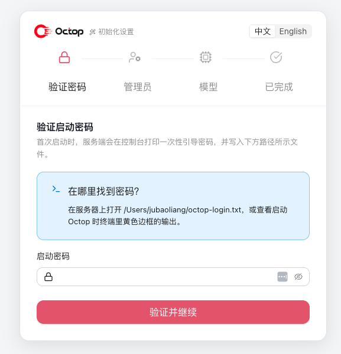

**步骤 1：设置密码**

- 首次配置需要一个临时"设置密码"作为保护。
- 输入并确认后进入下一步。

**步骤 2：创建管理员账号**

- 填写 **用户名**（默认 `admin`）、**密码**、**显示名称**。
- 该账号为首个管理员，拥有用户管理、系统设置等最高权限。
- 记下该账号，后续登录与日常使用都依赖它。

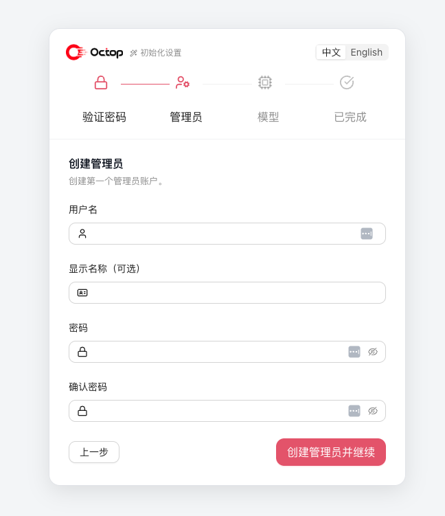

**步骤 3：配置模型（LLM 供应商）**

- 选择预设供应商（如 OpenAI、DeepSeek、Ollama 等）或自定义供应商。
- 填写 API Key、Base URL，勾选要启用的模型。
- 点击 **测试连接**，通过后点击 **继续**。
- 该步骤可**跳过**（Skip），稍后在控制台"设置 → 模型 / 供应商"中再配置。

详见下一节 [四、配置模型](#四配置模型llm-供应商)。

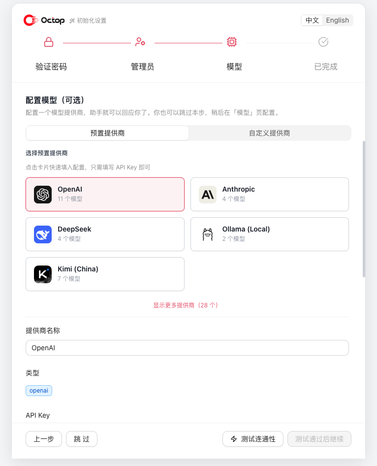

**步骤 4：完成**

- 向导写入配置、解锁完整 API，并自动以刚创建的管理员身份登录。
- 完成后进入 Web 控制台首页。

### 3.3 无人值守 / 跳过向导

对于自动化部署，可省略向导中的"设置密码"步骤，直接在 Web 控制台通过环境变量预设管理员身份后启动：

```bash
export OCTOP_ADMIN_USERNAME=admin
export OCTOP_ADMIN_PASSWORD=changeme
octop run
```

之后再在 Web 控制台中完成模型等其余配置即可。

---

## 四、配置模型（LLM 供应商）

Octop 通过 **供应商（Provider）** 接入大模型。每个 Agent 可使用不同的供应商与模型。支持 OpenAI 兼容 API、Anthropic、AWS Bedrock、DashScope（通义千问）、Ollama 本地模型等。

### 4.1 预设供应商

在向导"模型"步骤或控制台"设置 → 模型"中，可一键选择常见预设：

| 预设 | 说明 |
|------|------|
| OpenAI | 官方 API，需 API Key |
| Anthropic | Claude 系列，需 API Key |
| DeepSeek | 需 API Key |
| 智谱 Zhipu | 通义 / 智谱 GLM，需 API Key |
| Kimi | 月之暗面，需 API Key |
| Ollama | 本地模型，默认无需 API Key |

选择预设后会自动带出该供应商的默认 `base_url` 与内置模型列表。

### 4.2 自定义供应商

当所需服务不在预设中时（如自建 OpenAI 兼容网关、Azure OpenAI、第三方中转），可选择"自定义"：

- **类型（kind）**：`openai`（OpenAI 兼容）、`anthropic`、`bedrock`。
- **名称**：自定义显示名。
- **Base URL**：API 接入地址（如 `https://api.openai.com/v1`）。
- **API Key**：服务商提供的密钥。

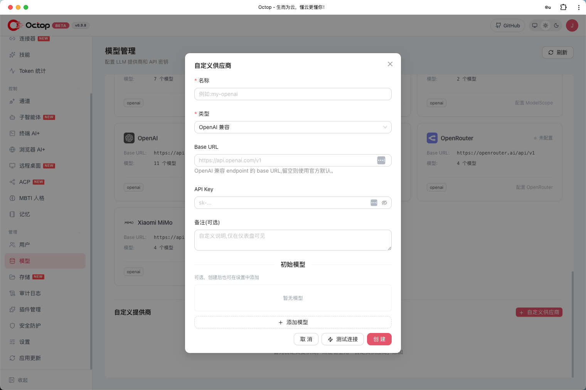

### 4.3 选择模型并测试连接

1. 在供应商下勾选要启用的模型（可全选 / 全不选）。
2. 点击 **测试连接**，系统会向供应商发送一次探测请求并显示延迟。
3. 测试通过后点击 **继续 / 保存**。

> 若测试失败，请检查 API Key、Base URL、网络连通性与账户配额。

### 4.4 在控制台中管理供应商

除首次向导外，日常可在 **设置 → 模型 / 供应商** 中：

- 新增 / 编辑 / 删除供应商。
- 为一个供应商增删模型（含自定义模型 ID、上下文窗口、最大 Token、是否支持推理）。
- 为不同 Agent 指定默认供应商与模型。

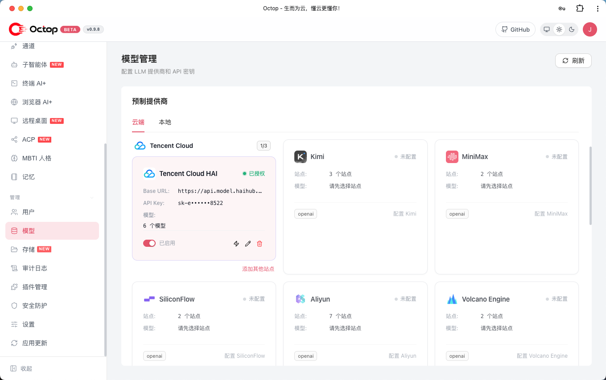

### 4.5 通过 CLI 配置供应商

```bash
octop models              # 查看供应商预设与模型解析
octop provider list       # 列出已配置供应商
octop provider --help     # 供应商增删改查帮助
```

### 4.6 本地模型 Ollama

若本机已运行 Ollama，可选择 `ollama` 预设（默认 `base_url` 为本地地址），无需 API Key 即可接入本地模型，适合隐私敏感或离线场景。

---

## 五、基本使用

### 5.1 登录

打开 **http://127.0.0.1:8088**，使用向导创建的账号登录。

> ⚠️ **安全提醒**：默认管理员密码为 `octop`。若使用默认值，请尽快在 **设置 → 用户** 中修改，避免服务暴露到公网时被未授权访问。

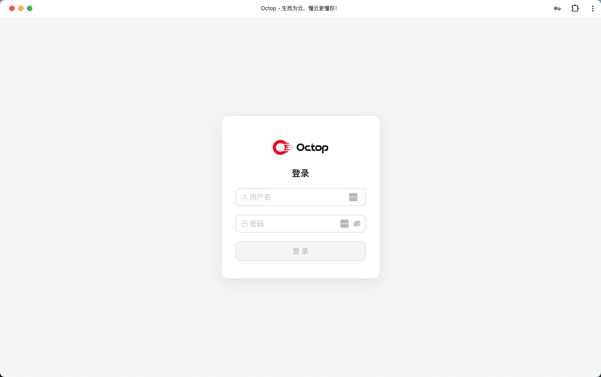

### 5.2 对话（Chat）

- 进入 **对话** 页面，选择当前 Agent 即可开始实时聊天。
- 支持多轮对话、附件上传、工具调用展示。
- 可在对话中通过斜杠命令（slash）触发特定能力。

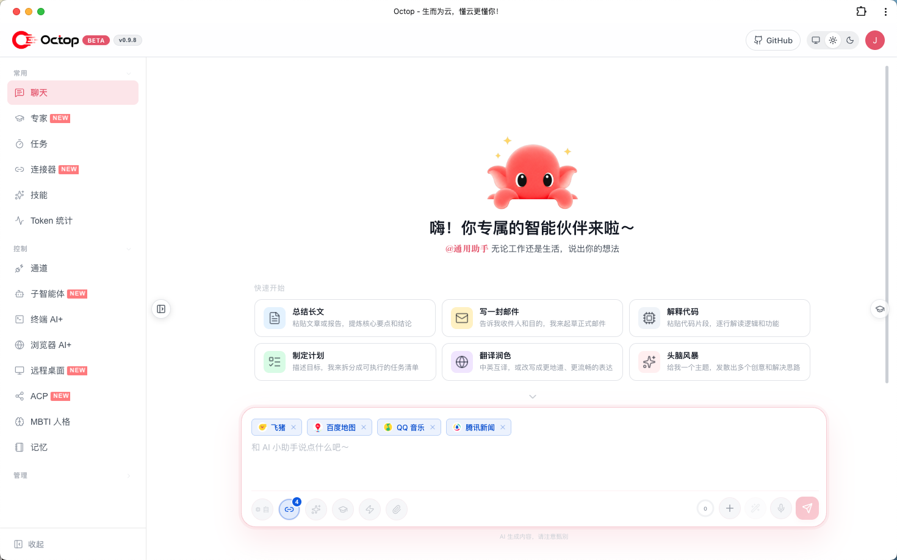

### 5.3 创建 Agent（专家库 / MBTI 人格）

- 进入 **Agent → 专家** 页面，从专家库模板中选择专业角色（如写作、编程、数据分析），一键创建。
- 选择 **MBTI 人格** 模板为 Agent 赋予性格（也可做人格测试自动生成）。
- 为该 Agent 指定 **供应商与模型**、工作区后端。

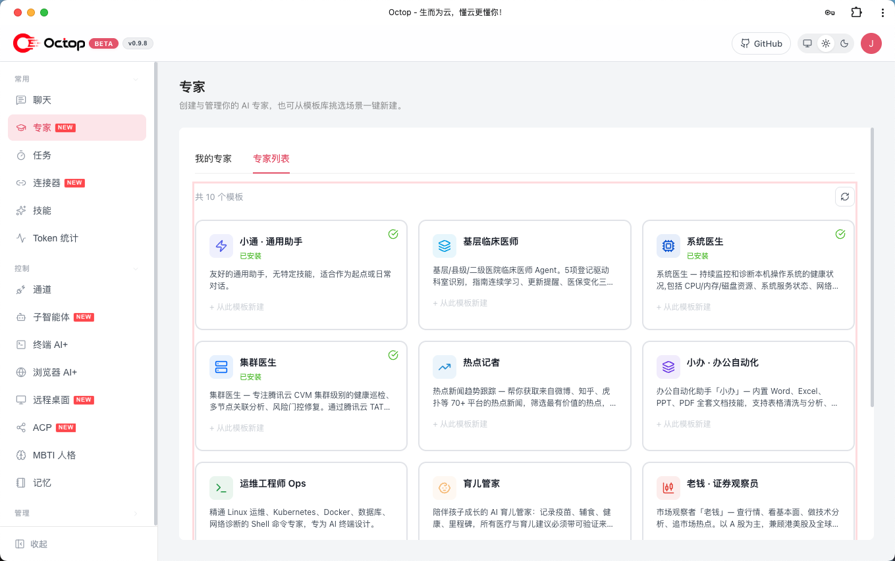

### 5.4 连接器（Connectors）

- 进入 **Connectors** 页面，配置 OAuth 应用与 MCP 网关。
- 通过连接器接入外部服务（如腾讯文档、微博、新闻等），扩展 Agent 的资源边界。

### 5.5 通道（Channels / IM）

- 进入 **通道** 页面，安装并配置 IM 平台：飞书、钉钉、QQ、Discord、企业微信等。
- 各通道所需凭证见下表：

| 通道 | 所需凭证 |
|------|----------|
| 飞书 | App ID、App Secret |
| 钉钉 | App Key、App Secret |
| QQ | Bot AppID、Token |
| Discord | Bot Token |
| 企业微信 | Corp ID、Agent Secret |
| Web 控制台 | 默认启用 |

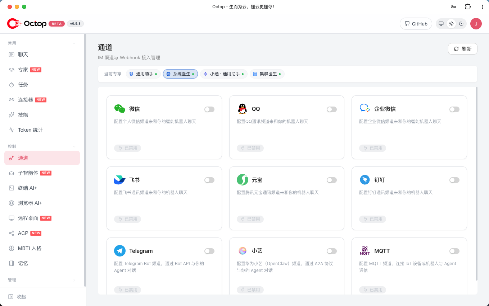

### 5.6 定时任务（Cron）

- 进入 **定时任务** 页面，可视化创建 Cron 任务。
- 支持自然语言或斜杠命令触发，让 Agent 按时推送或执行任务。

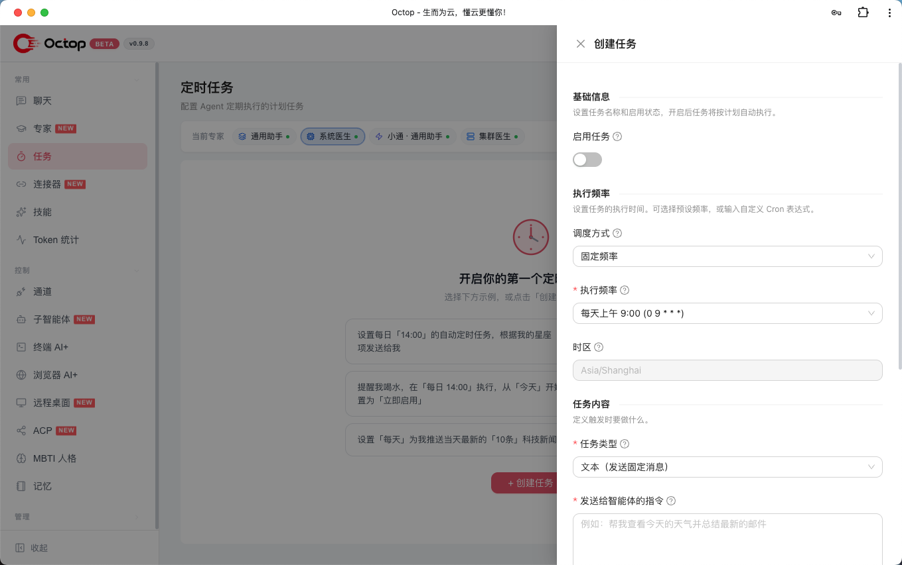

### 5.7 ACP（与 IDE / 编码 Agent 协作）

Octop 支持两个方向的 ACP 集成：

1. **入站** —— 让外部工具（Zed、OpenCode 等）使用你的 Octop Agent：

   ```bash
   octop acp --agent main
   ```

2. **出站** —— 在对话中把编码任务委派给外部 Agent（OpenCode、CodeBuddy、Claude Code、Codex）：
   - 控制台 → **ACP**：配置 Runner（按用户全局）。
   - 为 Agent 启用 `acp_runner`，然后在对话中委派。

完整配置见 [docs/acp.md](docs/acp.md)。

### 5.8 设置（用户 / 安全 / TLS / 系统）

- **用户**：管理账号、角色、修改密码。
- **安全**：工具审批、Shell 命令护栏（`~/.octop/security/tool_guard/`）。
- **TLS**：配置 HTTPS（自签或 Let's Encrypt）。
- **系统**：监听地址 / 端口、日志级别、定时任务时区等。

> 手动编辑配置文件：运行时参数保存在 `~/.octop/config.json`，可用环境变量覆盖（如 `OCTOP_PORT`、`OCTOP_BIND_HOST`）。详见 [docs/configuration.md](docs/configuration.md)。

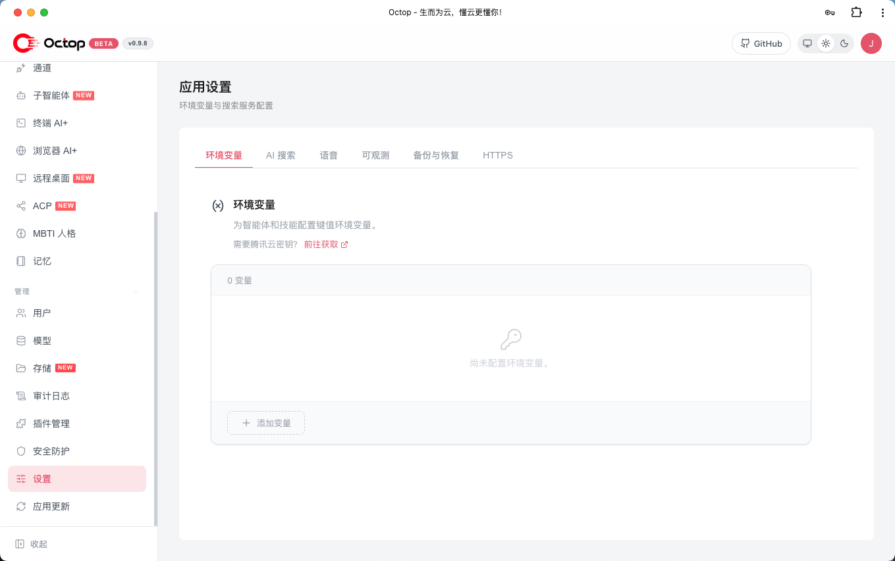

### 5.9 远程桌面与浏览器 AI

在 **控制台 → 控制（Control）** 页面中可使用：

- **远程桌面**：实时查看屏幕并控制键鼠，支持 Linux / Windows / macOS；无图形的 Linux 可一键创建隔离桌面，适合远程办公与 GUI 软件操作。

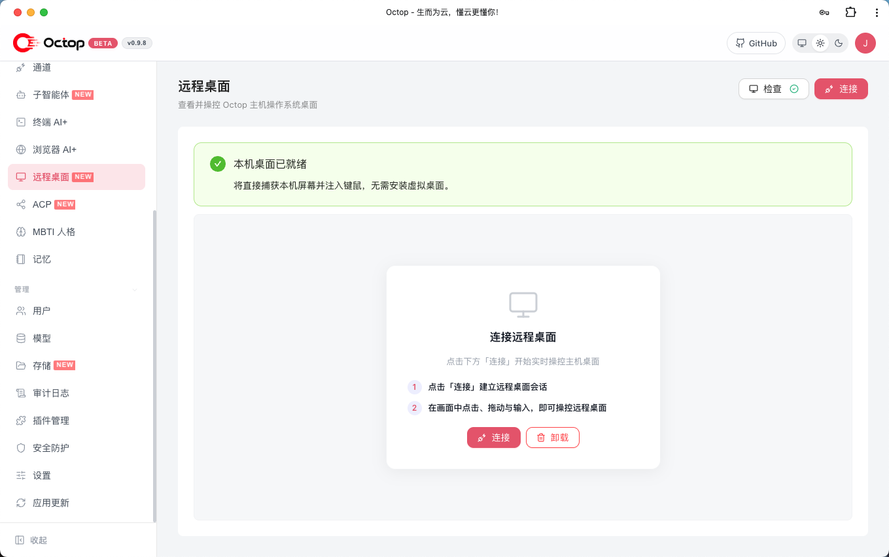

- **浏览器 AI+**：基于 Chromium 的无头会话，支持网页自动化、截图与远程浏览，内置 AI 助手与技能录制。

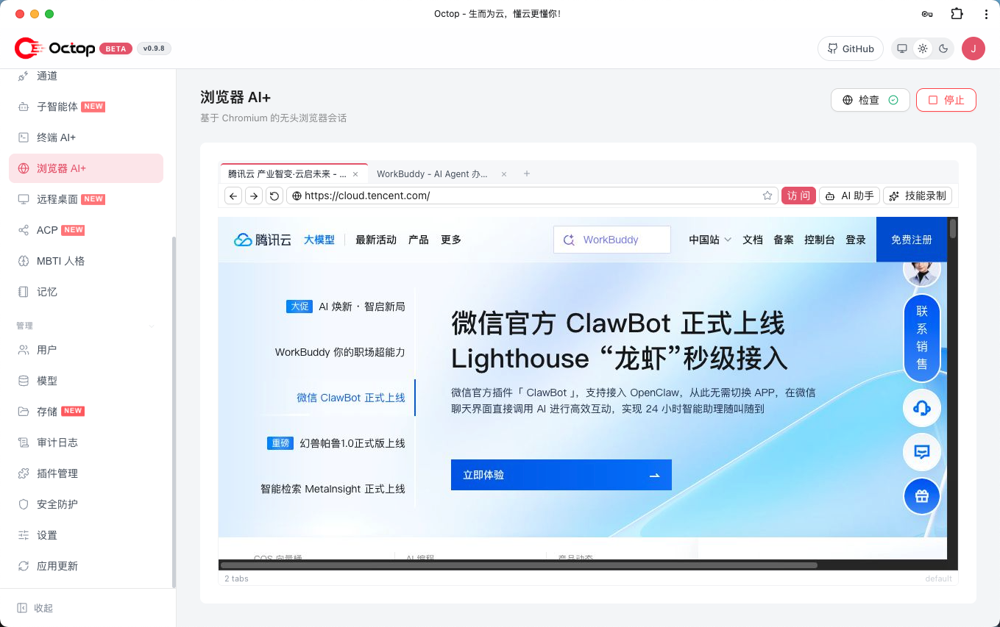

---

## 六、常用命令速查

| 命令 | 说明 |
|------|------|
| `octop run` | 前台启动 Octop |
| `octop run --host 0.0.0.0 --port 8088` | 自定义监听地址与端口 |
| `octop service start` | 安装并启动系统服务 |
| `octop service stop` | 停止系统服务 |
| `octop agent` | 创建、列出、启停 Agent |
| `octop channel` | 安装与管理 IM 通道 |
| `octop chats` | REPL 与会话管理 |
| `octop acp` | 为 IDE 提供 stdio ACP 服务 |
| `octop cron` | 管理定时任务 |
| `octop models` | 供应商预设与模型解析 |
| `octop provider list` | 列出已配置供应商 |
| `octop skills` | 按 Agent 启用 / 禁用 Skill |
| `octop user list` | 列出用户（管理员） |
| `octop backup` | 导出 / 恢复备份 |
| `octop update` | 检查并安装更新 |

完整参考见 [docs/cli.md](docs/cli.md)。

---

## 七、常见问题

**Q：访问 http://127.0.0.1:8088 打不开？**
- 确认已执行 `octop run` 且终端无报错。
- 若改过端口，请访问对应地址（如 `http://127.0.0.1:8088` 或自定义端口）。
- 用 `octop service status`（Linux / macOS）确认服务状态。

**Q：忘记管理员密码？**
- 可通过 CLI 重置或重新初始化（注意：重置密码请使用用户管理相关命令 / 直接管理数据库）。

**Q：模型测试连接失败？**
- 检查 API Key、Base URL 是否正确，网络是否可访问该服务，账户是否有配额。

**Q：如何修改监听地址让局域网访问？**
- 启动时：`octop run --host 0.0.0.0 --port 8088`；或设置环境变量 `OCTOP_BIND_HOST=0.0.0.0`、`OCTOP_PORT=8088`。

**Q：数据存放在哪里？**
- 全部在 `~/.octop/`：

```
~/.octop/
├── config.json              # 进程级配置（地址、端口、CORS、TLS …）
├── octop.db                 # SQLite — 用户、Agent、通道、定时任务 …
├── secrets/                 # JWT 密钥、通道 Token
├── agents/<agent_id>/       # 各 Agent 工作区（SOUL.md、skills …）
├── security/tool_guard/     # Shell 命令允许 / 拒绝规则
├── logs/                    # 运行日志
└── bin/octop                # PATH 包装脚本 → venv/bin/octop
```

**Q：如何升级？**
- `octop update`（若通过一键安装）；或从 PyPI / 源码重新安装后重启服务。

---

## 八、插图清单

文档中的插图汇总如下（已放置在 `docs/assets/` 目录）：

| 编号 | 位置 | 文件名 | 状态 | 内容说明 |
|------|------|--------|------|----------|
| 图 1.1 | 一、简介 | `overview.png` | ✅ 已就位 | Octop 品牌 Banner |
| 图 3.1 | 3.2 向导步骤 | `setup-01-steps.png` | ✅ 已就位 | 向导步骤条（验证密码页） |
| 图 3.2 | 3.2 管理员 | `setup-02-admin.png` | ✅ 已就位 | 创建管理员账号表单 |
| 图 3.3 | 3.2 模型 | `setup-03-model.png` | ✅ 已就位 | 向导内预设供应商选择 |
| 图 4.1 | 4.2 自定义 | `model-01-custom.png` | ✅ 已就位 | 自定义供应商弹窗 |
| 图 4.2 | 4.4 管理 | `model-02-manage.png` | ✅ 已就位 | 控制台模型管理页（预设/自定义供应商列表） |
| 图 5.1 | 5.1 登录 | `use-01-login.png` | ✅ 已就位 | 登录页面 |
| 图 5.2 | 5.2 对话 | `use-02-chat.png` | ✅ 已就位 | 对话主界面（Welcome + 快捷卡片） |
| 图 5.3 | 5.3 Agent | `use-03-agent.png` | ✅ 已就位 | 专家库模板列表 |
| 图 5.4 | 5.5 通道 | `use-04-channels.png` | ✅ 已就位 | IM 通道开关列表 |
| 图 5.5 | 5.6 Cron | `use-05-cron.png` | ✅ 已就位 | 创建定时任务弹窗 |
| 图 5.6 | 5.8 设置 | `use-06-settings.png` | ✅ 已就位 | 应用设置页面 |
| 图 5.7 | 5.9 远程桌面 | `use-07-remote-desktop.png` | ✅ 已就位 | 远程桌面连接页 |
| 图 5.8 | 5.9 浏览器 AI | `use-08-browser-ai.png` | ✅ 已就位 | 浏览器 AI+ 会话页 |
